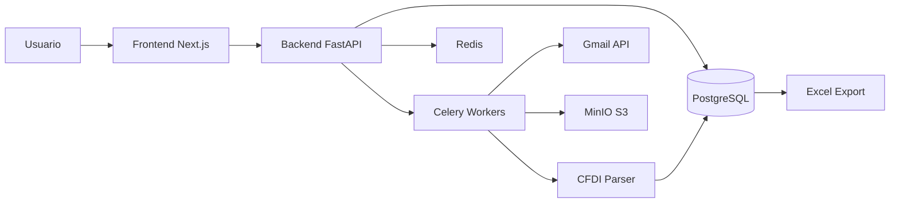
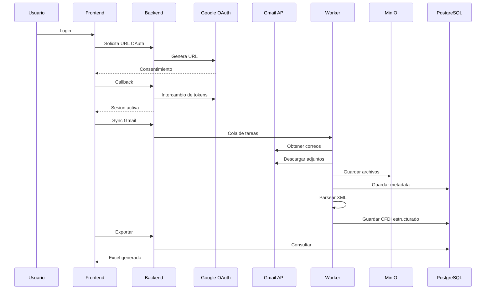

# DyA_Fac_v3_Claude_Code — SaaS Platform
# Proyecto XYZ

> **Nota:** Este proyecto está siendo desarrollado con Claude Code.
> Versión anterior con Codex disponible en: [link al repo original]


---

## Informacion General

- **Nombre:** DyA_Fac_v3_codex
- **Tipo:** Plataforma SaaS
- **Categoria:** Automatizacion financiera / CFDI
- **Autor:** Salvador Torres

---

## Vision del Producto

**DyA_Fac_v3_codex** es una plataforma SaaS disenada para automatizar la gestion de comprobantes fiscales digitales (CFDI). Integra directamente cuentas de Gmail y Google Workspace con un pipeline completo de procesamiento, almacenamiento y analisis fiscal.

Su objetivo central es transformar tareas manuales repetitivas en flujos automatizados, auditables y escalables, permitiendo a equipos contables y financieros enfocarse en el analisis en lugar de la captura de datos.

### Objetivo Principal

Automatizar el ciclo completo de gestion de CFDI:

```
Correo → Adjuntos → Parseo CFDI → Base de datos → Reportes / Analytics
```

---

## Problema que Resuelve

Las empresas y despachos contables enfrentan procesos ineficientes al gestionar sus comprobantes fiscales:

- Descarga manual de archivos XML y PDF desde correos electronicos.
- Captura repetitiva y propensa a errores en hojas de calculo.
- Errores humanos en la conciliacion de facturas.
- Falta de trazabilidad y control sobre los documentos procesados.
- Procesos que no escalan conforme crece el volumen de operaciones.

---

## Solucion

Un pipeline completamente automatizado que conecta el correo electronico con el procesamiento fiscal:

```
Gmail → XML/PDF → Parseo CFDI → PostgreSQL → Excel / Analytics
```

---

## Usuarios Objetivo

### Primarios

- **Contadores y despachos fiscales:** gestion diaria de facturas y conciliacion.
- **PyMEs:** automatizacion administrativa sin infraestructura compleja.

### Secundarios

- **CFOs y directivos financieros:** visibilidad y control sobre la operacion fiscal.
- **Equipos de BI y analistas:** acceso estructurado a datos para reportes y dashboards.

---

## Casos de Uso

- Automatizacion de la recepcion y clasificacion de facturas.
- Conciliacion contable basada en datos estructurados de CFDI.
- Generacion de reportes financieros a partir de la base de datos.
- Integracion administrativa con flujos existentes de trabajo.

---

## Arquitectura del Sistema

### Diagrama General



### Flujo Detallado



---

## Stack Tecnologico

### Backend

- **FastAPI** como framework principal
- **Python 3.12**
- **SQLAlchemy + Alembic** para ORM y migraciones
- **JWT + OAuth2 (Google)** para autenticacion

### Frontend

- **Next.js** con App Router
- **TypeScript**
- **TailwindCSS** para estilos
- **Zustand** para manejo de estado

### Infraestructura

- **PostgreSQL** como base de datos relacional
- **Redis** para cache y broker de mensajes
- **Celery** para procesamiento asincrono
- **MinIO (S3)** para almacenamiento de archivos
- **Docker / Docker Compose** para contenedorizacion

---

## Modulos del Sistema

### Autenticacion

- OAuth2 con Google para login seguro.
- Tokens JWT (access + refresh) para sesiones.
- Rotacion y renovacion automatica de credenciales.

### Gmail Sync

- Lectura automatica de correos con filtros configurables.
- Deteccion y descarga de adjuntos (XML/PDF).

### Procesamiento CFDI

- Parseo de archivos XML para extraer campos clave: RFC, Total, UUID, Fecha, entre otros.
- Validacion y normalizacion de datos antes de persistir.

### Almacenamiento

- **PostgreSQL** para datos estructurados y metadata.
- **MinIO** para archivos originales (XML/PDF).

### Reportes

- Exportacion a Excel con datos consolidados.
- Base para futuros dashboards analiticos.

### Procesamiento Asincrono

- **Celery Workers** con colas especializadas:
  - `email_sync` — sincronizacion de correos.
  - `cfdi_parse` — parseo de comprobantes.
  - `report_export` — generacion de reportes.

---

## Seguridad

- **OAuth 2.0 con Google** para autenticacion sin almacenar contrasenas.
- **Tokens JWT** (access + refresh) con expiracion controlada.
- **Encriptacion Fernet** para datos sensibles en reposo.
- **Variables de entorno** protegidas mediante archivo `.env`.
- Politica de rotacion periodica de credenciales.

### Variables Criticas

```
SECRET_KEY=
FERNET_KEY=
GOOGLE_CLIENT_ID=
GOOGLE_CLIENT_SECRET=
DATABASE_URL=
REDIS_URL=
MINIO_ROOT_PASSWORD=
```

---

## Estructura del Proyecto

```
DyA_Fac_v3_codex/
│
├── backend/
│   ├── app/
│   │   ├── api/
│   │   │   └── v1/
│   │   │       ├── auth.py
│   │   │       ├── gmail.py
│   │   │       ├── cfdi.py
│   │   │       └── exports.py
│   │   │
│   │   ├── core/
│   │   │   ├── config.py
│   │   │   ├── security.py
│   │   │   └── database.py
│   │   │
│   │   ├── models/
│   │   │   ├── user.py
│   │   │   ├── email.py
│   │   │   ├── cfdi.py
│   │   │   └── tenant.py
│   │   │
│   │   ├── schemas/
│   │   │   ├── auth.py
│   │   │   ├── email.py
│   │   │   ├── cfdi.py
│   │   │   └── export.py
│   │   │
│   │   ├── services/
│   │   │   ├── gmail_service.py
│   │   │   ├── gmail_ingestion.py
│   │   │   ├── cfdi_service.py
│   │   │   ├── cfdi_persistence.py
│   │   │   ├── cfdi_consolidation.py
│   │   │   ├── attachment_storage.py
│   │   │   └── export_service.py
│   │   │
│   │   ├── workers/
│   │   │   ├── celery_app.py
│   │   │   └── tasks.py
│   │   │
│   │   └── main.py
│   │
│   ├── tests/
│   │   ├── conftest.py
│   │   └── fixtures/
│   │
│   └── .env
│
├── frontend/
│   ├── app/
│   │   ├── (auth)/
│   │   │   └── login/
│   │   ├── dashboard/
│   │   │   ├── gmail/
│   │   │   ├── cfdi/
│   │   │   ├── exports/
│   │   │   └── settings/
│   │   │
│   │   └── layout.tsx
│   │
│   ├── components/
│   ├── store/
│   │   └── auth.ts
│   ├── lib/
│   │   └── apiClient.ts
│   └── styles/
│
├── infra/
│   ├── docker-compose.yml
│   └── Dockerfile
│
├── Makefile
├── README.md
├── PROJECT_STATUS.md
└── RUNBOOK_LOCAL.md
```

---

## Instalacion

### Infraestructura

```bash
make infra-up
```

### Backend

```bash
cd backend
python -m venv .venv
source .venv/bin/activate
pip install -r requirements-dev.txt
alembic upgrade head
uvicorn app.main:app --reload
```

### Frontend

```bash
cd frontend
npm install
npm run dev
```

---

## Endpoints

### Auth

- `GET /api/v1/auth/google/url` — obtener URL de autorizacion OAuth.
- `GET /api/v1/auth/callback` — callback tras autorizacion de Google.
- `POST /api/v1/auth/refresh` — renovar token de acceso.

### Gmail

- `GET /api/v1/gmail/accounts` — listar cuentas conectadas.
- `POST /api/v1/gmail/sync` — iniciar sincronizacion de correos.

### CFDI

- `GET /api/v1/cfdi/` — consultar comprobantes procesados.

---

## Testing

```bash
pytest                  # Tests del backend
npx playwright test     # Tests end-to-end del frontend
```

---

## Metricas de Exito

- **Reduccion de tiempo:** mayor al 80% respecto al proceso manual.
- **Precision:** superior al 99% en el parseo de CFDI.
- **Rendimiento:** CFDIs procesados por minuto como indicador de throughput.
- **Velocidad de reportes:** tiempo de generacion de exportaciones Excel.

---

## Roadmap

### Fase 1 — Fundacion

- [x] Autenticacion OAuth con Google
- [x] Sincronizacion de Gmail
- [x] Parseo basico de CFDI

### Fase 2 — Funcionalidad Core

- [ ] Dashboard analitico
- [ ] Exportaciones avanzadas
- [ ] Sync incremental de Gmail

### Fase 3 — Escalabilidad

- [ ] Arquitectura multi-tenant
- [ ] Sistema de roles y permisos

### Fase 4 — Inteligencia

- [ ] Clasificacion automatica con Machine Learning

---

## Riesgos Identificados

- **Cambios en la API de Gmail:** posibles breaking changes que afecten la sincronizacion.
- **Variabilidad en CFDI:** distintas versiones y formatos de comprobantes fiscales.
- **Seguridad de credenciales:** manejo correcto de tokens OAuth y llaves de encriptacion.
- **Escalabilidad:** asegurar rendimiento conforme crece el volumen de usuarios y datos.

---

## Consideraciones Tecnicas

- El procesamiento asincrono se maneja con **Celery**, evitando bloqueos en el event loop principal.
- El `attachment_id` de Gmail es dinamico y requiere obtenerse en tiempo de ejecucion.
- Los nombres de archivos se normalizan antes de almacenarlos en MinIO para evitar conflictos.

---

## Definition of Done

Para considerar una funcionalidad completa, debe cumplir:

- Funciona end-to-end sin errores.
- Logs correctamente implementados.
- Manejo adecuado de errores y casos limite.
- Pruebas escritas y pasando.
- Documentacion actualizada.

---

## Estado Actual

- OAuth operativo y funcional.
- Infraestructura estable (Docker + PostgreSQL + Redis + MinIO).
- Pipeline Gmail → CFDI en fase de integracion.
- Sistema base levantado y en desarrollo activo.

---

## Pendientes

- Screenshots del sistema.
- Demo funcional.
- Video walkthrough.

---

## Licencia

Uso privado — Proyecto en desarrollo.

**Autor:** Salvador Torres
